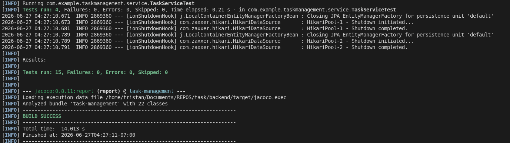

# 📋 Task Management System

A full‑stack task management application built with **Spring Boot** (backend) and **Angular** (frontend), featuring JWT authentication, Redis‑based distributed rate limiting, pagination, comprehensive testing, and a clean Material Design UI.

---

## 🚀 Live Demo

The backend is live on Render:

- **API Base URL:** [https://task-management-dir0.onrender.com](https://task-management-dir0.onrender.com)
- **Swagger UI:** [https://task-management-dir0.onrender.com/swagger-ui.html](https://task-management-dir0.onrender.com/swagger-ui.html)
- **OpenAPI JSON:** [https://task-management-dir0.onrender.com/v3/api-docs](https://task-management-dir0.onrender.com/v3/api-docs)

The rate limiter is active (100 requests per minute per IP) – try it with the provided endpoints.

---

## 🚀 Features

- **User Authentication** – Register and login with JWT tokens (24‑hour expiry)
- **Task CRUD** – Create, read, update, and delete tasks
- **Status Management** – Mark tasks as Pending, In Progress, or Completed
- **Pagination & Filtering** – Fetch tasks with page/size and filter by status (`/api/tasks?page=0&size=10&status=PENDING`)
- **Data Transfer Objects (DTOs)** – Clean separation between API and domain models with validation
- **Custom Exception Handling** – Meaningful error responses with proper HTTP status codes
- **Distributed Rate Limiting** – 100 requests per minute per IP (backed by Redis, scalable across multiple instances)
- **API Documentation** – Interactive Swagger UI at `/swagger-ui.html`
- **Testing** – 15+ unit & integration tests with JaCoCo coverage reporting
- **Responsive UI** – Angular Material + Flex Layout
- **Docker Support** – Run the entire stack with a single command
- **Deployed on Render** – Publicly accessible backend with PostgreSQL and Redis

---

## 🧰 Tech Stack

### Backend
- Java 11+
- Spring Boot 2.7.5
- Spring Security & JWT
- Spring Data JPA
- PostgreSQL (production) / MySQL (development)
- Redis (distributed rate limiting)
- Maven
- Swagger / OpenAPI (springdoc‑openapi)
- JaCoCo (code coverage)

### Frontend
- Angular 14+
- Angular Material
- RxJS
- TypeScript
- SCSS

---

## 📦 Prerequisites

- **Java 11+** – [Download](https://adoptium.net/)
- **Node.js 14+** – [Download](https://nodejs.org/)
- **MySQL / MariaDB** – [Installation guide](https://mariadb.org/download/)
- **Redis** – [Install](https://redis.io/download) or use Docker
- **Maven** – [Install](https://maven.apache.org/install.html) (or use the wrapper)
- **Angular CLI** (optional) – `npm install -g @angular/cli`

---

## ⚙️ Setup

### 1. Clone the repository
```bash
git clone https://github.com/yourusername/task-management.git
cd task-management
```

### 2. Backend Setup

#### a) Start MySQL and Redis (local or via Docker)
- **MySQL**: Create a database and user (see below).
- **Redis**: Run `redis-server` (or `docker run -d --name redis -p 6379:6379 redis:alpine`).

```sql
CREATE DATABASE taskdb CHARACTER SET utf8mb4 COLLATE utf8mb4_unicode_ci;
CREATE USER 'taskuser'@'localhost' IDENTIFIED BY 'your_secure_password';
GRANT ALL PRIVILEGES ON taskdb.* TO 'taskuser'@'localhost';
FLUSH PRIVILEGES;
```

#### b) Configure environment variables
Copy `.env.example` (if provided) or set these in your shell:

```bash
export DB_URL="jdbc:mysql://localhost:3306/taskdb?useSSL=false&allowPublicKeyRetrieval=true&serverTimezone=UTC"
export DB_USERNAME="taskuser"
export DB_PASSWORD="your_secure_password"
export REDIS_HOST="localhost"
export REDIS_PORT="6379"
export JWT_SECRET="your_strong_secret_key"
export JWT_EXPIRATION="86400000"
```

Alternatively, you can edit `backend/src/main/resources/application.properties` directly (but don't commit secrets).

#### c) Build and run the backend
```bash
cd backend
mvn clean package
mvn spring-boot:run
```

The backend will be available at `http://localhost:8080`.  
Swagger UI: `http://localhost:8080/swagger-ui.html`

---

### 3. Frontend Setup

```bash
cd frontend
npm install
npm start   # or ng serve
```

The frontend will be served at `http://localhost:4200`.

---

## 🐳 Docker Compose (All Services)

The project includes a `docker-compose.yml` that runs MySQL, Redis, the backend, and the frontend together.

```bash
# Build JAR first (required for Docker)
cd backend && mvn clean package && cd ..

# Start all containers
docker compose up -d --build
```

- **Frontend**: `http://localhost`
- **Backend API**: `http://localhost:8080`
- **Swagger**: `http://localhost:8080/swagger-ui.html`
- **MySQL**: `localhost:3306` (or `3307` if you changed it)
- **Redis**: `localhost:6379`

---

## 🌐 Environment Variables

| Variable | Default | Description |
|----------|---------|-------------|
| `DB_URL` | `jdbc:mysql://localhost:3306/taskdb?...` | JDBC URL for MySQL (or PostgreSQL) |
| `DB_USERNAME` | `root` | Database username |
| `DB_PASSWORD` | `root` | Database password |
| `REDIS_URL` | (optional) | Redis connection string (e.g., `rediss://...`) – overrides host/port/password |
| `REDIS_HOST` | `localhost` | Redis server host (if using separate variables) |
| `REDIS_PORT` | `6379` | Redis server port |
| `REDIS_PASSWORD` | (optional) | Redis password (if any) |
| `JWT_SECRET` | `mySuperSecretKey123!` | Secret for signing JWTs (change in production!) |
| `JWT_EXPIRATION` | `86400000` | Token validity in milliseconds (24h) |
| `RATE_LIMIT` | `100` | Requests per minute per IP (configurable) |

> **Note:** In production (Render), we use `REDIS_URL` with the `rediss://` scheme for TLS.

---

## 🧪 Testing & Quality

### Backend
```bash
cd backend
mvn clean test
```
- **JaCoCo coverage report** – available at `target/site/jacoco/index.html`
- **Integration tests** – use H2 in‑memory database and spin up a test context

### Frontend
```bash
cd frontend
ng test --watch=false --code-coverage
```

---

## 📁 Project Structure

```
task-management/
├── backend/                         # Spring Boot backend
│   ├── src/main/java/...            # Application code
│   ├── src/test/java/...            # Unit & integration tests
│   ├── src/main/resources/          # Properties, static files
│   └── pom.xml
├── frontend/                        # Angular frontend
│   ├── src/app/                     # Components, services
│   ├── src/environments/            # Environment configs
│   ├── angular.json
│   └── package.json
├── docker-compose.yml               # Full stack orchestration
└── README.md
```

---

## 📬 API Endpoints (All under `/api`)

| Method | Endpoint | Description | Authentication |
|--------|----------|-------------|----------------|
| POST   | `/auth/register` | Register a new user | Public |
| POST   | `/auth/login`    | Login – returns JWT | Public |
| GET    | `/tasks`         | Get paginated tasks (supports `page`, `size`, `status`, `sort`) | JWT required |
| POST   | `/tasks`         | Create a new task | JWT required |
| PUT    | `/tasks/{id}`    | Update a task (authorisation: only owner) | JWT required |
| DELETE | `/tasks/{id}`    | Delete a task (authorisation: only owner) | JWT required |

> **Pagination example:** `/api/tasks?page=0&size=10&status=PENDING&sort=createdAt,desc`

---

## 🔒 Security

- Passwords hashed with BCrypt.
- JWT tokens are signed and validated.
- CORS configured to allow frontend origins.
- Rate limiting protects against abuse (100 requests/minute per IP) – works across multiple instances via Redis.

---



## 🚀 Production Readiness

- [x] Redis‑based distributed rate limiting
- [x] Comprehensive test suite with JaCoCo coverage
- [x] Swagger/OpenAPI documentation
- [x] Docker containerisation
- [x] Environment‑based configuration
- [x] Custom exception handling with meaningful HTTP statuses
- [x] Deployed on Render with PostgreSQL and Upstash Redis

---

## 🤝 Contributing

1. Fork the repository.
2. Create a feature branch: `git checkout -b feature/your-feature`.
3. Commit your changes: `git commit -am 'Add some feature'`.
4. Push to the branch: `git push origin feature/your-feature`.
5. Open a Pull Request.

---

## 📄 License

This project is licensed under the MIT License – see the [LICENSE](LICENSE) file for details.

---

## ✨ Acknowledgements

- [Spring Boot](https://spring.io/projects/spring-boot)
- [Angular](https://angular.io/)
- [Angular Material](https://material.angular.io/)
- [Redis](https://redis.io/)
- [Swagger/OpenAPI](https://swagger.io/)
- [Render](https://render.com/) – for hosting the backend
- [Upstash](https://upstash.com/) – for free Redis hosting

---

**Happy coding!** 🚀